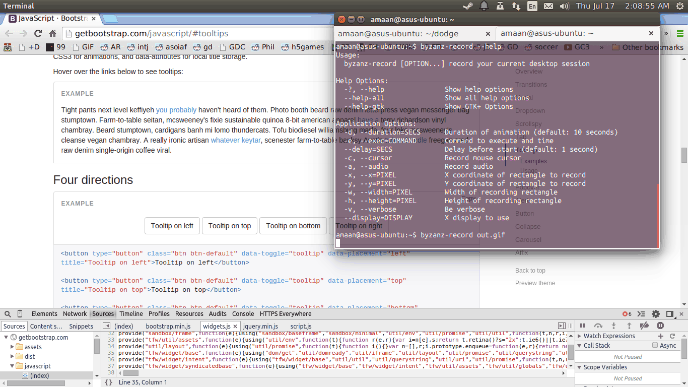

## DevTools 里你可能没注意到的功能

碰到一个工具，先浏览一下官方文档是个好习惯。一上来就用，碰到问题再看文档是大多数人的习惯，但这常常会让你漏掉很多有趣的东西。其实快速浏览不会费时，这里是 DevTools 的文档：[链接](https://developer.chrome.com/devtools/index)。
如果你想看原版，可以略过此文，去官方看，你肯定会有收获。

**这里主要列出一些我觉得非常常用的功能。**

* ### `Ctrl(Cmd) + Shift + C` 快速开启或关闭 **审查模式**

  推荐尽量使用这个功能，而不是用鼠标右键开启审查功能，因为很多时候 鼠标 的事件会影响页面交互，而通过这几个按键影响页面交互的可能性很低。

* ### **审查模式** 下选中元素后，按 `H` 隐藏或显示该元素

  这个功能适合快速定位元素位置，或者查看被该元素遮挡的元素。

* ### 冻结 js 线程

  

  你可能会碰到这样的情况。你需要 审查 某个只有当鼠标 hover 时才会显示的元素。这时你发现通过用鼠标或者 `Ctrl(Cmd) + Shift + C` 审查都行不通。
  这时只需要冻结页面 js 线程即可：

  - 选中 **源码栏**
  - 用鼠标触发想要的 UI 交互
  - Windows 按 `F8`，Mac 按 `fn + F8`，冻结 js 线程
  - 然后就可以用 `放大镜` 按钮或者 `Ctrl(Cmd) + Shift + C` 来审查元素了。

*****************************************************************************

* ### 快捷键 `Ctrl(Cmd) + O`

  

  和 Sublime Text 类似的一个功能，快速搜索打开文件。比如用它快速打开 **资源** 面板里的 CSS，JS，Snippet。

*****************************************************************************

* ### 快捷键 `Ctrl(Cmd) + Shift + O`

  上一个功能的变种，在文件里搜索 JS 函数或 CSS 选择器

*****************************************************************************

* ### JS Snippet 功能

  

  这个功能相当好用，你可以保存一些 JS 代码片段，这个片断会在所有页面的 DevTools 间共享。
  只要不删除它们，就会一直存在。随时可以右键运行片断。常常会用于保存通用的调试代码。

  你甚至能选中一个 snippet 中的某一行在 console 里运行。

*****************************************************************************

* ### Console 的 过滤

  

  比如你有个 mousemove 的事件需要 debug，你可能会 log 大量的数据，这很可能会干扰你的调试，这时用过滤会是不错的选择，比如我只想要输出里含有数值的结果，我们可以利用 正则 `\d+` 。

*****************************************************************************

* ### 利用 `debugger` 断点调试

  

  这个是 v8 提供的接口，也就是说 Node 里也能用。v8 在调试模式下运行到这个 关键词 会在此处打断程序，等待 resume。

*****************************************************************************

* ### `$` 和 `$$` 选择器

  

  事实上不用引入 jquery，DevTools 也能使用类似 `$` 的函数。区别在于 `$` 返回的是一个 DOM Element，`$$` 返回的是 Element 数组。

*****************************************************************************

* ### `$0`, `$1`, `$3`... 变量

  

  快速访问最近 **审查** 过的 DOM 对象。

* ### 异步调试

  

  这个功能能辅助调试异步代码，尤其是追踪异步调用栈，比如 ajax 请求。启动之后会自动追踪 `setInterval, setTimeout, XMLHttpRequest, promises, requestAnimationFrame, MutationObservers` 等函数的调用栈。

  这里有篇详细介绍的文章：[链接](http://www.html5rocks.com/en/tutorials/developertools/async-call-stack/)
